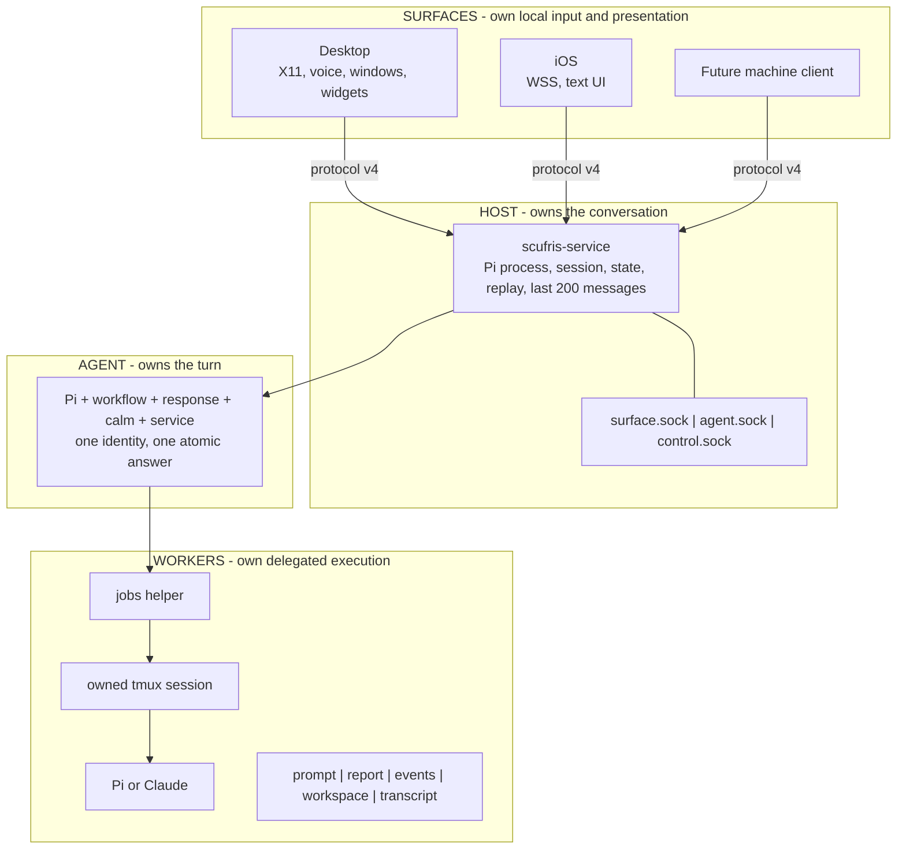
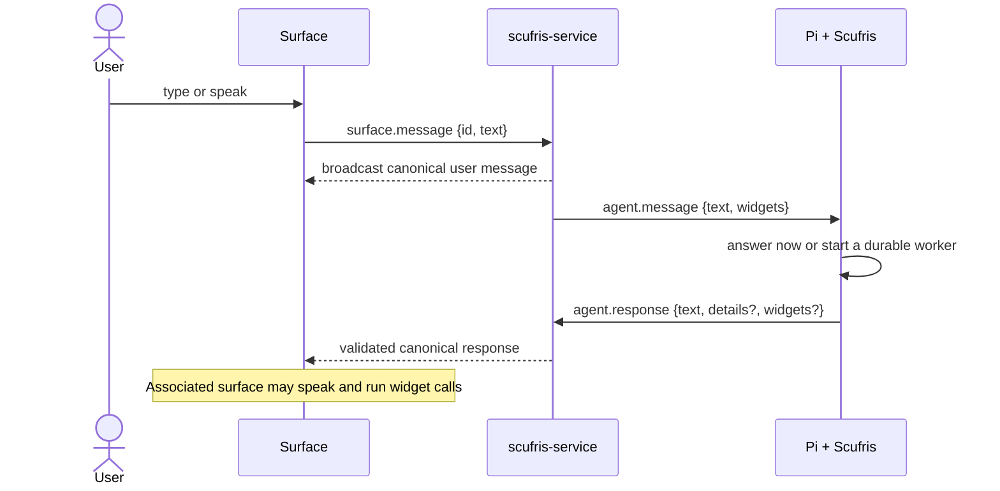
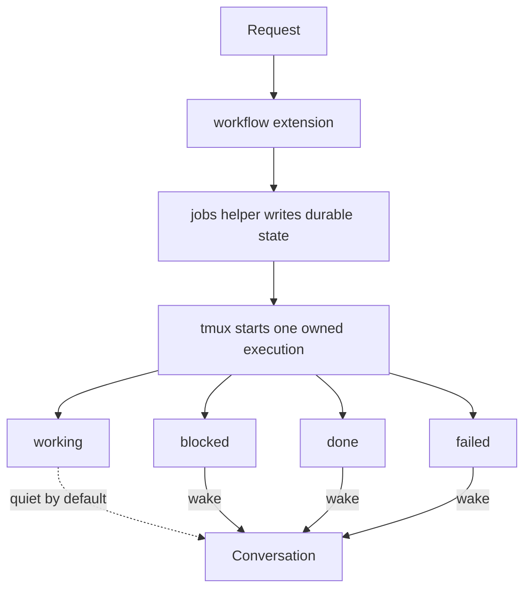
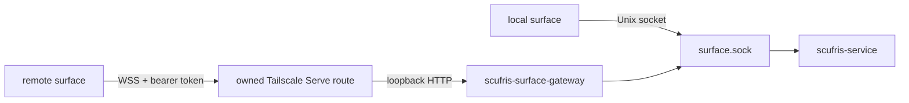
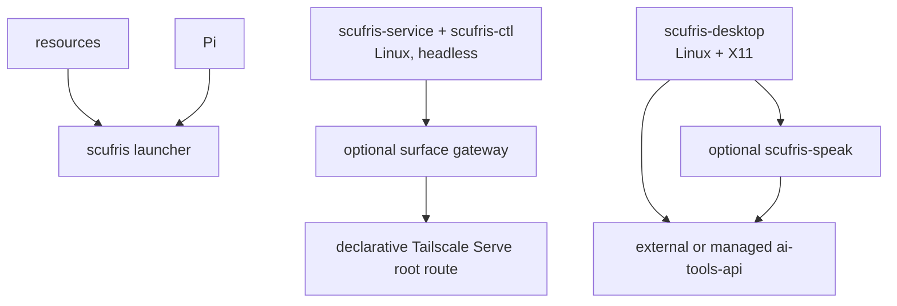

# See the stack

[Previous: Start here](../overview.md)

Scufris has four layers. Read the diagram from the user toward the work.



## One user message



A surface crash does not stop Pi. A Pi restart does not erase the session. A
worker does not block the foreground conversation.

## One delegated job



A logical job can have several generations. Steering stops the old execution,
keeps the workspace and harness session, and starts the next generation.
Landing and cleanup are explicit.

## Ownership map

```text
agent/extensions/scufris/   Pi lifecycle, tools, state, routing
agent/skills/               model-facing workflow policy
host/service/               headless conversation owner and scufris-ctl
shared/control/             protocol v4 types, bounds, and socket paths
surfaces/desktop/           Linux/X11 surface, voice, windows, widgets
surfaces/ios/               SwiftUI remote surface
scripts/                    commands for people
tools/                      deterministic helpers called by extensions
nix/                        packages, module, staging, checks, docs
```

Code belongs with its runtime owner. Do not put window policy in the agent. Do
not put conversation state in a surface. Do not make an extension do process or
filesystem work that a small helper can do.

## Local and remote paths



Only surface traffic crosses the gateway. `agent.sock` and `control.sock` stay
local.

## Trust boundaries

| Boundary       | Rule                                                             |
| -------------- | ---------------------------------------------------------------- |
| Surface input  | Strict protocol version, type, identifier, and byte bounds       |
| Agent output   | One validated atomic response                                    |
| Worker reports | Fresh capability for each generation                             |
| Job files      | Bounded reads, regular files, `O_NOFOLLOW` where required        |
| Reviewer tools | Harness-specific read allowlist; not an OS sandbox               |
| Remote surface | Loopback gateway, private token, owned Tailscale Serve TLS route |

## Package graph



The desktop is not in the launcher closure. Graphical libraries are not in the
service closure. Speech is not in the agent process tree.

## State map

```text
$XDG_RUNTIME_DIR/scufris/         sockets; disappears with the login session
$XDG_DATA_HOME/scufris/sessions/  canonical Pi conversation
$XDG_STATE_HOME/scufris/jobs/     jobs and archived workflows
$XDG_STATE_HOME/scufris-desktop/  pending transcript + stable surface ID
```

`SCUFRIS_RUNTIME_DIR` moves the socket group for staging. The complete variable
list is in [Environment variables](../reference/environment.md).

---

Next: [Install it](../guide/installation.md)
