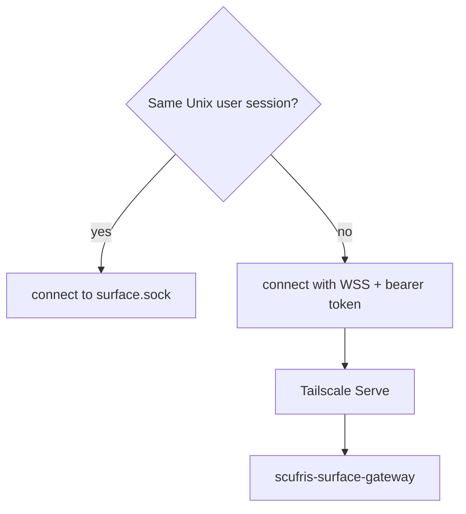
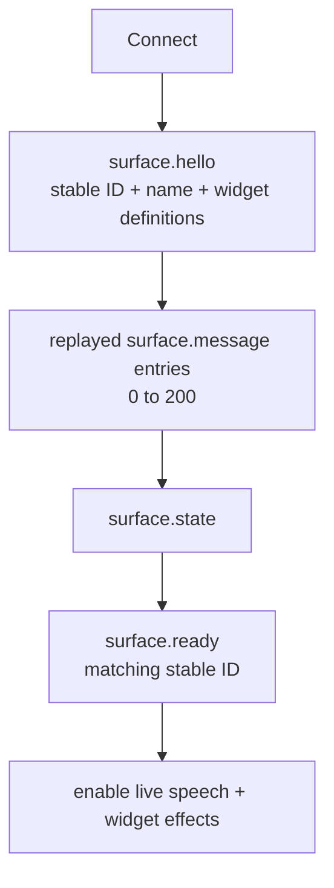
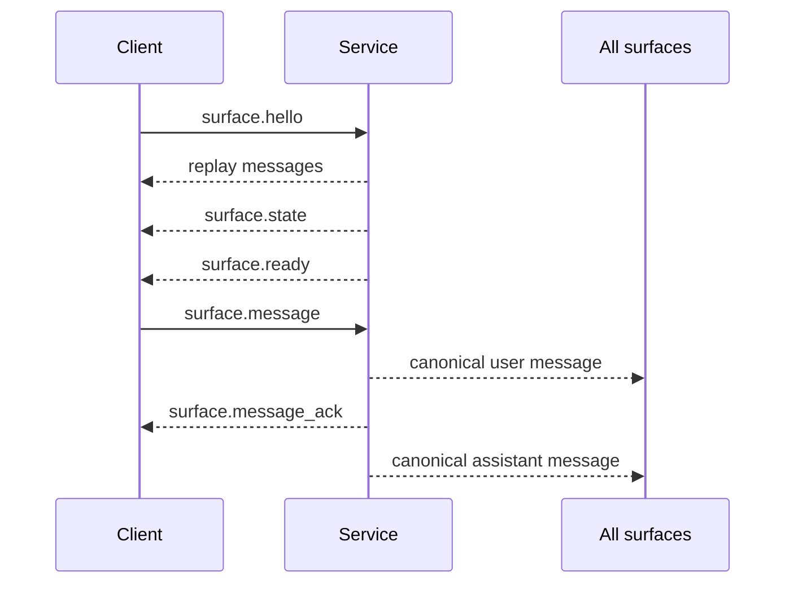
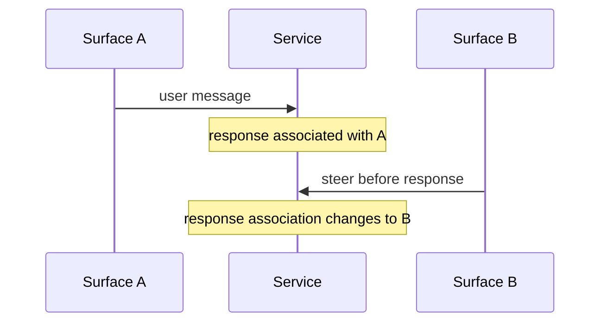
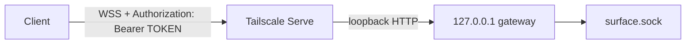
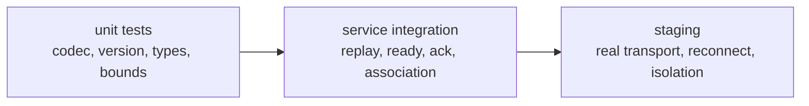

# Add a surface

[Previous: Use it](../guide/using.md)

A surface is a client of the one Scufris conversation. It can run on the host,
on another laptop, on a phone, or on a machine with no Pi installation.

## Choose the transport



The message protocol is the same on both transports. Unix transport uses one
LF-terminated JSON object per frame. WebSocket transport uses one JSON object
per text frame. The remote gateway is also a bounded HTTP API on the same
loopback listener and bearer-token boundary:

| Method       | Path                    | Purpose                                          |
| ------------ | ----------------------- | ------------------------------------------------ |
| `GET`        | `/` or `/surface`       | Upgrade to a protocol-v5 surface WebSocket       |
| `GET`        | `/health`               | Read the authenticated gateway identity          |
| `POST`       | `/audio/transcription`  | Forward a bounded mono PCM WAV to host inference |
| `POST`       | `/attachments?name=...` | Upload one bounded object                        |
| `GET`/`HEAD` | `/attachments/{id}`     | Download or inspect one managed object           |

Attachment uploads use the object media type as `Content-Type` and return the
canonical descriptor. Downloads support one standard byte range and return
`Accept-Ranges`, `Content-Range`, and `206 Partial Content` as applicable. Every functional route requires the same bearer token; opaque IDs are not
authorization. Staging alone enables unauthenticated `/docs/` and
`/api/openapi.json` metadata so Swagger can load in a browser.

The transcription route accepts at most 2 MiB and 60 seconds of audio. It sends
multipart `file`, `model=whisper-1`, and `response_format=json` to the loopback
`ai-tools-api`. Its bounded `{ "text": "..." }` response is presentation data,
not a surface message. The iOS app places it in the editable composer and sends
it only through an ordinary protocol-v5 `surface.message` after confirmation.

## Surface lifecycle



Clear the local conversation before each reconnect. Store replay messages, but
do not speak them and do not run their widget calls. Start live presentation
only after `surface.ready` contains the ID sent in `surface.hello`.

## Minimal client flow



Use a fresh bounded ID for each submission. Keep pending text until the matching
`surface.message_ack` arrives. On disconnect, show an unknown outcome and do
not resend automatically.

Abort is similar:

```text
surface.abort {id} -> surface.aborted {id}
```

## Messages a client sends

All messages include `"v": 5`. Surface submissions carry only managed
attachment IDs. The service resolves them into canonical descriptors before a
message reaches the agent, another surface, or replay.

```json
{"v":5,"type":"surface.hello","surface":{"id":"laptop-a","name":"Laptop A","widgets":[]}}
{"v":5,"type":"surface.message","id":"message-1","text":"What changed?","attachments":["att_opaque"]}
{"v":5,"type":"surface.abort","id":"abort-1"}
```

## Messages a client receives

| Type                  | Client action                                                                                                             |
| --------------------- | ------------------------------------------------------------------------------------------------------------------------- |
| `surface.message`     | Store and display it                                                                                                      |
| `surface.message_ack` | Settle the matching pending submission                                                                                    |
| `surface.aborted`     | Settle the matching abort                                                                                                 |
| `surface.state`       | Show `failed`, `blocked`, `working`, `starting`, or `idle`; conversation views present working as transient `thinking...` |
| `surface.ready`       | End replay; enable live effects                                                                                           |
| `surface.rejected`    | Show the bounded code/detail; keep user data when relevant                                                                |

A conversation message contains `role`, `surface`, `text`, optional `details`,
optional widget calls, and zero to eight immutable attachment descriptors. Each
descriptor contains the opaque ID, display name, media type, and size. The
`surface` field is the stable ID associated with that turn.

## Association rule



Every surface displays the response. Only the associated ready surface may
speak it or execute its live widget calls.

A service that has just started holds no association. An unprompted answer sent
before the owner's first message is rejected with `no_surface` and reaches no
surface at all.

## Bounds to copy into every client

| Value                       | Bound                          |
| --------------------------- | ------------------------------ |
| Encoded frame or JSON line  | 64 KiB including LF on Unix    |
| Identifier                  | 64 ASCII identifier characters |
| Surface name                | 256 bytes                      |
| User or response text       | 8 KiB UTF-8                    |
| Response details            | 32 KiB UTF-8                   |
| State/rejection detail      | 4 KiB UTF-8                    |
| Widget definitions or calls | 32                             |
| Widget description          | 2 KiB UTF-8                    |
| Widget schema or arguments  | 16 KiB encoded JSON            |
| Attachment references       | 8 unique IDs per message       |
| Attachment object           | 16 MiB                         |
| Attachment display name     | 255 UTF-8 bytes                |
| Attachment media type       | 127 ASCII bytes                |
| Retained conversation       | 200 messages                   |

Reject wrong versions, unknown message types, invalid enum values, oversized
frames, and unexpected binary WebSocket frames. Do not silently accept a newer
protocol.

The canonical Rust types and validators are in
`shared/control/src/service.rs`. Use them directly for Rust clients. Other
languages should mirror those exact tagged messages and bounds. The Swift
example is in `surfaces/ios/Sources/Protocol.swift` and
`ConversationStore.swift`.

## Local surface recipe

1. Generate a stable private ID once. Store it mode 0600.
2. Resolve `surface.sock` through `SCUFRIS_RUNTIME_DIR`, then
   `XDG_RUNTIME_DIR/scufris`.
3. Connect a Unix stream.
4. Send `surface.hello` as one JSON line.
5. Read and validate one bounded line at a time.
6. Reconnect with bounded backoff.
7. Stop only processes and sockets this surface owns.

Do not connect to `agent.sock` or `control.sock`. They are different typed
channels.

## Remote surface recipe



1. Enable `service.remoteSurface` as shown in [Installation](../guide/installation.md#remote-surfaces).
2. Keep the gateway listener on loopback. The binary refuses non-loopback
   addresses.
3. Home Manager reconciles the Tailscale Serve root route in front of it.
4. Send `Authorization: Bearer <token>` during the WebSocket handshake.
5. Use text frames only.
6. Store URL, token, and stable surface ID in the platform secret store.

The token file must be absolute, regular, private (`0600`), visible ASCII, and
32 to 256 bytes. The gateway compares the complete bearer value in constant
time and forwards only strict surface messages.

## Add widgets to a new surface

A surface may register zero or more definitions:

```json
{
  "name": "battery",
  "description": "Battery: Show this device's battery state",
  "input_schema": { "type": "object", "additionalProperties": true }
}
```

The service sends the selected surface's current definitions to Pi with each
message. If the answer contains a matching call, the associated live surface
may render it. Rendering stays local. There is no result or acknowledgement
protocol.

A machine that cannot render widgets should register `[]`.

## Test the new surface



Start a backend:

```bash
nix run .#staging -- backend
```

For a local client, point it at:

```bash
export SCUFRIS_RUNTIME_DIR="$XDG_RUNTIME_DIR/scufris-staging"
```

For a remote client, use the WSS URL and token path printed by staging. Set
`SCUFRIS_STAGING_EXTERNAL_SURFACES=local` when a loopback WebSocket test is
enough.

## Existing examples

| Surface             | What it demonstrates                                                                   |
| ------------------- | -------------------------------------------------------------------------------------- |
| `surfaces/desktop/` | Unix socket, replay barrier, pending submissions, voice, widgets, local command socket |
| `surfaces/ios/`     | WSS bearer auth, Keychain identity/config, reconnect, text conversation                |

---

Next: [Add a widget](widgets.md)
