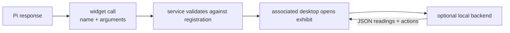
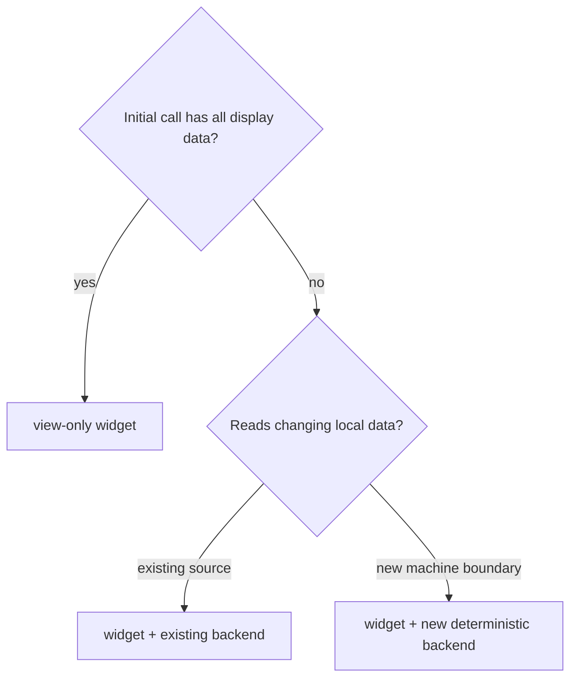
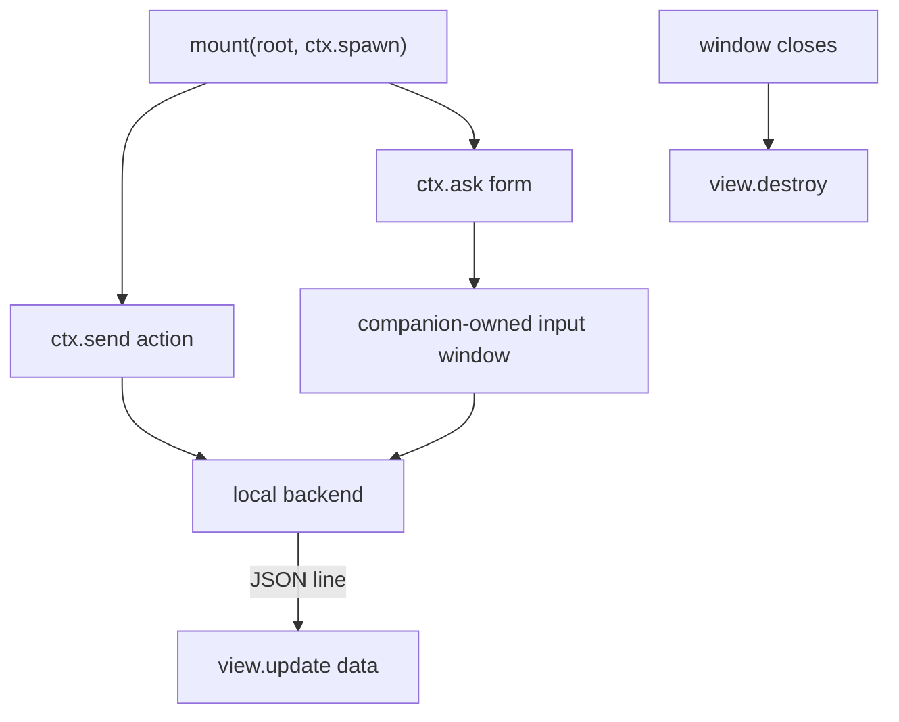
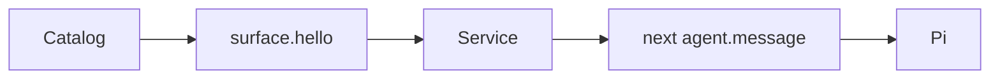

# Add a widget

[Previous: Add a surface](surfaces.md)

A widget is a local view. It is not a Pi tool and it never returns a result to
the conversation.



## Choose a widget type



## Directory shape

A shipped widget lives at:

```text
surfaces/desktop/widgets/NAME/
├── widget.toml
└── widget.ts
```

A local external widget uses compiled JavaScript:

```text
$MY_WIDGET_ROOT/NAME/
├── widget.toml
└── widget.js
```

Add one or more roots with `SCUFRIS_WIDGET_PATH`, separated like `PATH`.
External widgets are additive. They cannot shadow shipped widgets or a widget
from an earlier root. Invalid external widgets are logged and skipped.

## Manifest

```toml
id = "battery"
name = "Battery"
description = "Show this machine's current battery state."
width = 300
height = 180
backend = "system"       # optional; must be installed
cadence = 1000            # optional milliseconds; default 1000
shared = true             # optional; default true
spawn = { every = 5 }     # optional data merged before call arguments
```

Rules:

```text
directory name == id
id is a protocol identifier
width and height are bounded
backend names an installed backend
no duplicate id
```

`shared = true` lets equal requests share one backend process. Use `false` for
stateful instances such as two independent timers.

## View contract

Every module exports one function:

```ts
export function mount(root: HTMLElement, ctx: WidgetContext): WidgetView {
  // Build DOM under root. Read ctx.spawn for the initial value.
  return {
    update(data: unknown): void {
      // Validate and draw one backend reading.
    },
    destroy(): void {
      // Release local resources.
    },
  };
}
```

The full shared type contract is
`surfaces/desktop/widgets/widget.d.ts`.



Build DOM directly. Use the shared `--sw-*` CSS tokens. Do not draw window
chrome, grab focus, start a private timer for backend data, or trust unknown
input without checking it.

## Backend rule

Backends live under `surfaces/desktop/backends/NAME/`. They are deterministic
processes compiled into the desktop package. A backend reads bounded JSON
commands and writes bounded JSON readings. The desktop owns its child handle or
process group and stops only that process.

Use an existing backend when possible:

| Backend           | Use                                     |
| ----------------- | --------------------------------------- |
| `system`          | Host CPU, memory, temperature, and load |
| `timer`           | Independent countdown state             |
| `den`             | Read/write the-den journal              |
| `claude`, `codex` | Local account usage data                |

A new backend is needed only for a new machine or data boundary. Keep it small,
use Python 3 standard library unless a package is justified, and write one JSON
object per line. Put platform probing in the backend, not in TypeScript.

## Add a shipped widget

```text
1. copy the nearest widget
2. rename the directory and manifest id together
3. write the manifest description for both user and model
4. implement mount/update/destroy
5. add or reuse a backend
6. build: build.rs compiles widget.ts into the desktop
7. test catalog + UI + backend separately
```

Start from `cpu` for a live graph, `timer` for private state, or `notes` for a
form and write path.

## Add a machine-specific widget without rebuilding Scufris

Compile your TypeScript to one `widget.js`, then run:

```bash
SCUFRIS_WIDGET_PATH="$PWD/widgets" \
  nix run .#scufris-desktop -- --foreground
```

This can use no backend or a backend already built into Scufris. A new external
backend is not loaded from `SCUFRIS_WIDGET_PATH`; add a new backend to the
source tree and rebuild the desktop.

## Surface registration

At startup the desktop reduces each widget to:

```json
{
  "name": "battery",
  "description": "Battery: Show this machine's current battery state.",
  "input_schema": { "type": "object", "additionalProperties": true }
}
```



The script never crosses the socket. Only the definition and later call
arguments do.

## Test checklist

```text
manifest
  [ ] invalid TOML, wrong id, duplicate id, and missing backend fail safely

view
  [ ] mount, first spawn, update, malformed update, destroy
  [ ] no focus theft and no global DOM state

backend
  [ ] valid spawn/action/readings
  [ ] malformed and oversized input
  [ ] child exit, stale reading, restart, exact shutdown

integration
  [ ] definition appears in surface.hello
  [ ] live associated call opens once
  [ ] replay and another surface do not execute the call
```

Run the focused Rust and UI checks listed in [Test a change](testing.md).

---

Next: [Test a change](testing.md)
