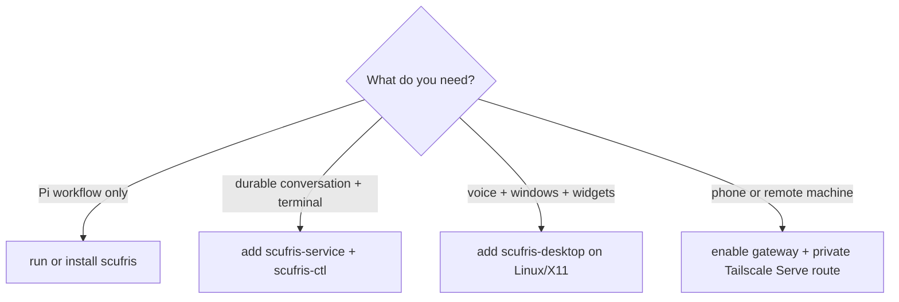
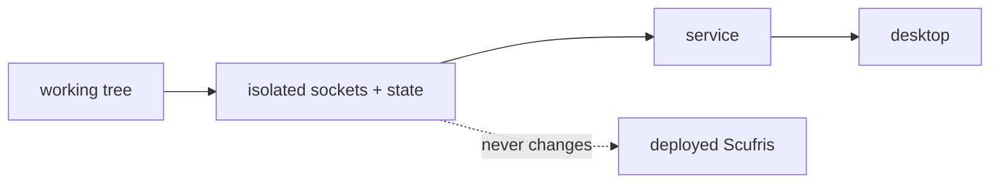
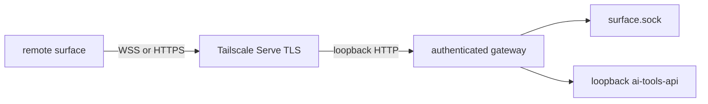

# Install it

[Previous: See the stack](../dev/architecture.md)

## Choose a shape



| Host                 | Agent        | Service      | Desktop             | Recommended test                              |
| -------------------- | ------------ | ------------ | ------------------- | --------------------------------------------- |
| NixOS Linux          | yes          | yes          | yes, on X11         | Home Manager or staging                       |
| Other Linux with Nix | yes          | yes          | yes, on X11         | `nix run .#staging -- up`                     |
| macOS with Nix       | yes          | no           | no                  | `nix run .#scufris`                           |
| Linux without Nix    | source build | source build | source build on X11 | [No-Nix tests](../dev/testing.md#without-nix) |
| iOS                  | surface only | no           | native iOS app      | simulator, then staging gateway               |

## Fastest full-stack test

From a checkout on Linux with Nix:

```bash
git clone https://github.com/alexjercan/scufris2.git
cd scufris2
nix run .#staging -- up
```



Press `Ctrl+C` to stop only that staging stack. See [Run staging](../dev/staging.md)
for split backends, several frontends, and remote surfaces.

## Run the agent only

Release:

```bash
nix run github:alexjercan/scufris2/v1.1.0#scufris
```

Checkout:

```bash
nix run .#scufris
```

This works on the flake's Linux and macOS systems. It starts Pi with the four
Scufris extensions. It does not start the service, desktop, or speech.

## Pin the flake

```nix
{
  inputs.scufris = {
    url = "github:alexjercan/scufris2/v1.1.0";
    inputs.nixpkgs.follows = "nixpkgs";
  };
}
```

Available outputs:

```text
all flake systems                    Linux only
-----------------                    ----------
scufris / default                    scufris-service
resources                            scufris-ctl
docs                                 scufris-desktop
                                     scufris-speak
                                     scufris-staging
                                     ai-tools-api
```

## Home Manager: agent only

Import the module on NixOS or on any Home Manager host:

```nix
{inputs, ...}: {
  imports = [inputs.scufris.homeModules.default];
  programs.scufris.enable = true;
}
```

This installs the `scufris` launcher.

## Home Manager: headless service

```nix
programs.scufris = {
  enable = true;
  service.enable = true;
};
```

```text
default.target
     |
     v
scufris-service.service -> one Pi RPC agent -> session directory
     |
     +-> scufris-ctl over control.sock
```

The service does not need a display. Its default session directory is
`$XDG_DATA_HOME/scufris/sessions`.

## Complete Linux stack

```nix
programs.scufris = {
  enable = true;
  service.enable = true;
  desktop = {
    enable = true;
    speech.enable = true;
  };
};
```

The desktop requires the service. Speech gives only the desktop a synthesizer.
The agent and service stay silent.

Choose who owns the shared inference API:

```text
An existing `services.ai-tools-api` or external API
  -> programs.scufris.aiToolsApi.enable = false;

Scufris should run its pinned API
  -> programs.scufris.aiToolsApi.enable = true;
```

For an external endpoint:

```nix
programs.scufris = {
  aiToolsApi.enable = false;
  desktop.aiToolsApi.baseUrl = "http://127.0.0.1:10300";
};
```

Scufris derives `/v1/audio/transcriptions` and `/v1/audio/speech` from this
base URL.

## Remote surfaces

Create a private token:

```bash
install -d -m 700 ~/.local/share/scufris/credentials/remote
openssl rand -hex 32 >~/.local/share/scufris/credentials/remote/surface-token
chmod 600 ~/.local/share/scufris/credentials/remote/surface-token
```

Enable the complete private WSS and media API endpoint:

```nix
programs.scufris.service.remoteSurface = {
  enable = true;
  port = 10440;
  tokenFile = "${config.xdg.dataHome}/scufris/credentials/remote/surface-token";
};
```

Home Manager starts both the loopback gateway and a declaratively reconciled
Tailscale Serve route at `/`. The login user must already belong to the tailnet and be allowed
to run `tailscale serve`; no Tailscale credential enters the Nix store. Inspect
the two owned units with:

```bash
systemctl --user status scufris-surface-gateway.service
systemctl --user status scufris-tailscale-serve.service
tailscale serve status
```



Never expose the plain loopback HTTP listener directly. Continue with
[Add a surface](../dev/surfaces.md) before implementing a client.

## Direct package smoke tests

```bash
nix run .#scufris-service -- --help
nix run .#scufris-desktop -- --print-config
nix run .#scufris-desktop -- --foreground
```

`--print-config` opens no window. `--foreground` logs to stderr. The desktop is
Linux/X11 only and reports the backend as unavailable until the service is on
the same socket.

---

Next: [Configure it](configuration.md)
