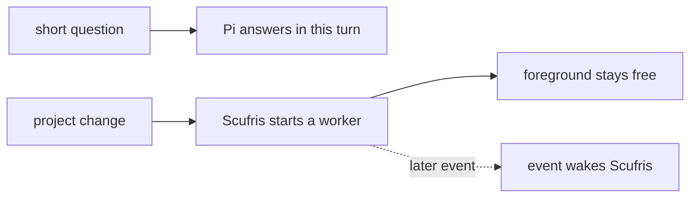
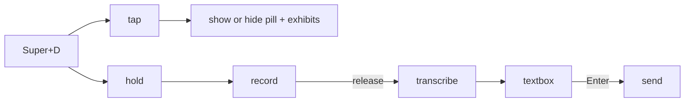
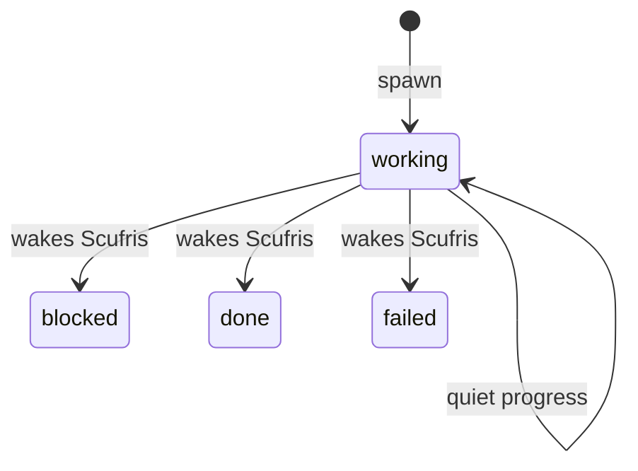
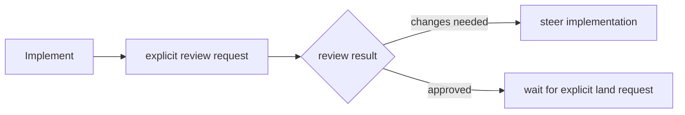
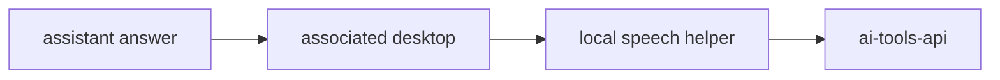
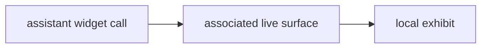

# Use it

[Previous: Configure it](configuration.md)

## Talk to Scufris



Every answer has:

```text
plain text                 optional details           optional widget calls
shown everywhere           shown, never spoken        run only on one surface
```

## Use the desktop

The default key is `Super+D`.



While the textbox is open:

| Key      | Result  |
| -------- | ------- |
| `Enter`  | Send    |
| `Escape` | Discard |
| `Ctrl+C` | Copy    |

While the pill is visible:

| Default key    | Result                                    |
| -------------- | ----------------------------------------- |
| `Super+Escape` | Cancel the take or put the workspace away |
| `Super+Delete` | Abort the active Scufris run              |

A transcript is saved before submission. If delivery is uncertain, Scufris
shows the text again and does not resend it by itself.

## Read the conversation

```text
click pill
    or
scufris-ctl hud
    |
    v
conversation window: last 200 canonical messages + transient thinking state + input line
```

`Enter` sends. `Shift+Enter` adds a line. `Escape` closes the window. The `+`
control selects up to eight files for the next message. Canonical files in the
conversation have explicit open and save controls; executable and unknown
binary types are save-only. A desktop crash does not stop the conversation
because the service owns it.

Useful local commands:

```bash
scufris-ctl hud     # toggle the conversation window
scufris-ctl open    # start/stop a voice take
scufris-ctl show    # show the workspace
scufris-ctl hide    # hide the workspace
scufris-ctl state   # read service state
```

A window manager can bind them:

```text
bindsym $mod+d exec --no-startup-id "scufris-ctl open"
bindsym $mod+s exec --no-startup-id "scufris-ctl hud"
```

When the window manager owns the popup key, tap/hold detection is no longer
available for that key. `open` becomes a two-press start/stop action.

## Watch a delegated job



Use `/wake all` to wake on `working` too. Use `/wake minimal` to restore the
default. Use `/calm off` to show Pi thinking and tool rows; `/calm on` is the
default.

Inspect jobs from a shell:

```bash
scripts/scufris-jobs all
scripts/scufris-jobs <id-prefix>
scripts/scufris-jobs all --archived --json
```

Workers run in named tmux sessions. Attach read-only if you need to watch. Do
not type into a worker pane. Ask Scufris to steer, stop, review, or land it.

## Ask for review and landing



Scufris never lands implicitly. Quick Review uses a separate bounded Pi RPC
agent and leaves the foreground conversation available.

## Speech



No desktop means silence. A desktop without `desktop.speech.enable` is also
silent. Mute and unmute from the tray. Details are never spoken.

## Widgets



Widgets are presentation, not tools. They do not send results back to Pi. A
user can pin, unpin, restart, or close a desktop widget locally. Continue with
[Add a surface](../dev/surfaces.md), then [Add a widget](../dev/widgets.md).

---

Next: [Add a surface](../dev/surfaces.md)
