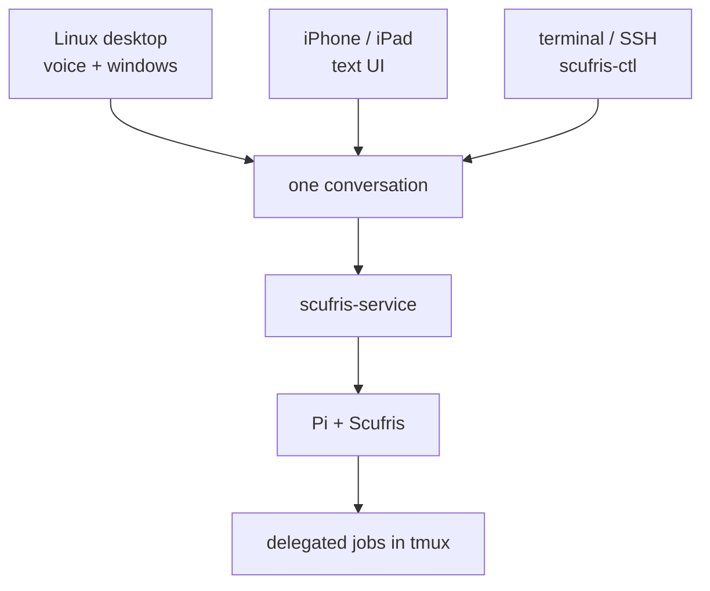
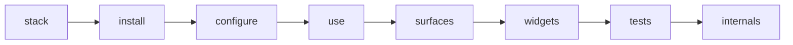
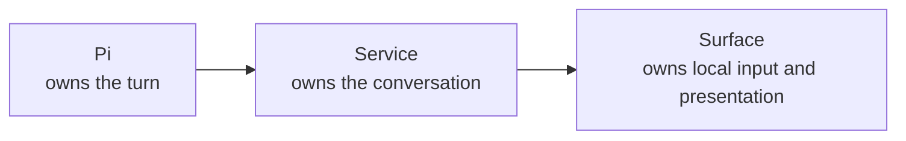

# Start here

Scufris is one conversation with many ways to reach it.

## Read this book in order

Each chapter adds one layer:

The short path is:

1. [See the stack](dev/architecture.md).
2. [Install it](guide/installation.md).
3. [Configure it](guide/configuration.md).
4. [Use it](guide/using.md).

Continue through surfaces and tests before the internal chapters. Each page
links back to the idea it builds on.

## Pick the result you want

| Goal                                                | Start with                                                                       |
| --------------------------------------------------- | -------------------------------------------------------------------------------- |
| Try the full stack without changing your system     | [Staging](dev/staging.md)                                                        |
| Install the agent only                              | [Installation: choose a shape](guide/installation.md#choose-a-shape)             |
| Run the desktop and voice UI                        | [Installation: complete Linux stack](guide/installation.md#complete-linux-stack) |
| Connect a phone or another machine                  | [Add a surface](dev/surfaces.md)                                                 |
| Add a visual panel                                  | [Add a widget](dev/widgets.md)                                                   |
| Find one setting                                    | [Configuration](guide/configuration.md)                                          |
| Find one environment variable                       | [Environment reference](reference/environment.md)                                |
| Test on NixOS, another Linux, macOS, or without Nix | [Testing](dev/testing.md)                                                        |

## Three rules

This split is the key to every later chapter.

---

Next: [See the stack](dev/architecture.md)
