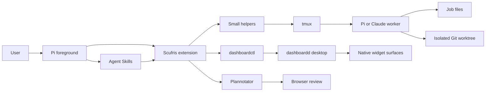
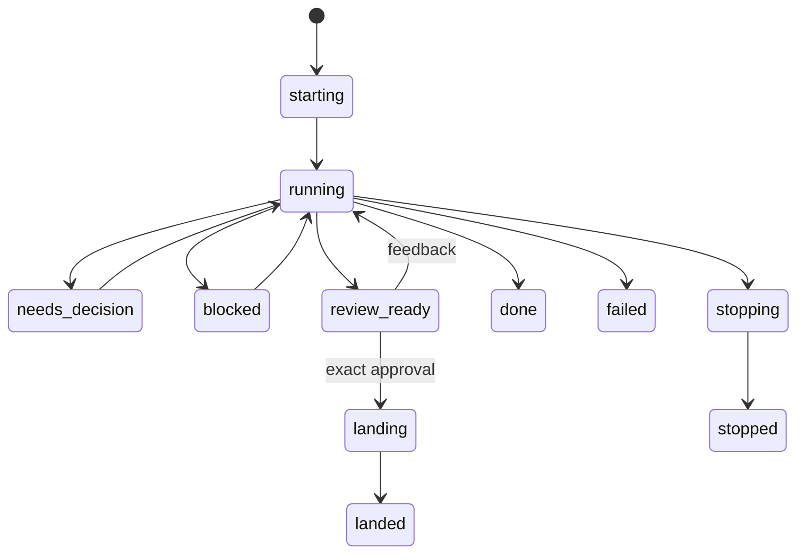
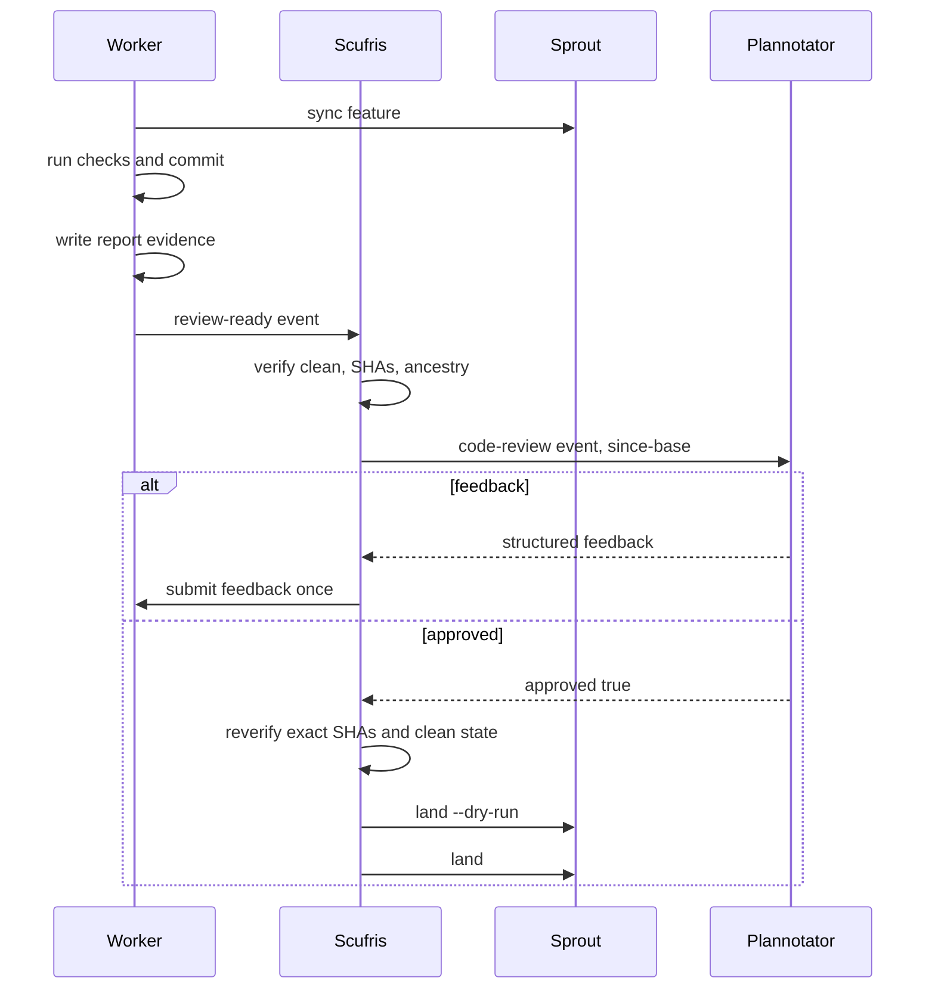
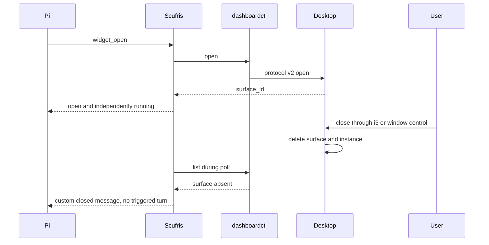

# Scufris architecture

## Recommendation

Build Scufris as one Pi package with:

- One narrow TypeScript extension.
- Agent Skills for delegation and widget workflows.
- Small Python and Bash helpers for job files, Git, tmux, and dashboardctl mechanics.
- Direct Pi or Claude Code processes in tmux.
- Sprout worktrees.
- Dashboardd as an external presentation service.

Do not add a daemon, MCP server, RPC bridge, embedded agent runtime, generic shell tool, data-query layer, or recovery supervisor.

## Boundaries



### Pi foreground

Owns:

- Conversation.
- Model selection and reasoning level.
- Built-in file tools.
- Skill discovery.
- Model mediation for decisions, blockers, completion, and failure.

Does not own:

- Worker execution.
- Native widget windows.
- Dashboard runtime instances.
- Git landing semantics.

### Scufris TypeScript extension

Owns only Pi-specific or in-memory concerns:

- Native and discovery-derived tool registration.
- `session_start` and `session_shutdown`.
- One fixed one-second timer.
- In-memory job and opened-surface ownership.
- Coalesced Pi notifications and custom follow-up messages.
- Safe child-helper invocation with argument arrays.

It does not parse shell commands, implement Git, inspect arbitrary paths, or embed harness-specific process logic.

### Skills

Own model-facing workflows:

- When delegation is appropriate.
- When a visual widget is appropriate.
- How to select spawn, inspect, send, stop, and widget tools.
- How to retain job and surface IDs in conversation context.

Skills do not own persistent background processes.

### Helpers

Own deterministic mechanics:

- Create and validate job records.
- Launch and address exact tmux windows through fixed helper verbs and generated IDs, then replace the helper process with the harness.
- Read incremental status bytes.
- Create, synchronize, and inspect sprout worktrees.
- Invoke dashboardctl without a shell.
- Validate Git revisions before review and landing.

Use Python standard library and small Bash adapters. Helpers accept narrow verbs and IDs. They do not expose raw command execution to the model.

### Delegated workers

Each worker is one direct interactive Pi or Claude Code process in one tmux window and one isolated worktree.

Workers own:

- Reasoning and tool use for the delegated request.
- Sparse status appends.
- `report.md`.
- Feature commits.
- Reading repository instructions, selecting applicable checks, and recording their outcomes before `review-ready:`.

Workers do not land, push, create other workers, or control dashboardd.

### Dashboardd

Owns:

- Widget discovery.
- Runtime instances and backends.
- Tauri windows.
- Surface focus and close.
- Native user-driven close behavior.

Scufris only invokes released `dashboardctl` operations and tracks returned surface IDs.

### Plannotator and sprout

Sprout owns worktree creation, synchronization, and guarded landing. Plannotator owns human review presentation. Scufris calls Plannotator through its public Pi event API and uses sprout commands without replacing either contract.

## Project and harness policy

Version 1:

- Requires a user-trusted current Git repository.
- Delegates only in that repository.
- Has no Scufris project configuration.
- Defaults Pi to `openai/gpt-5.6-sol` with medium thinking.
- Defaults Claude to `opus` with xhigh thinking.
- Lets the foreground orchestrator override model and thinking per spawn.
- Does not sandbox filesystem or network access.
- Runs workers with local-user authority.
- Uses `--dangerously-skip-permissions` for Claude.

Workers read repository instructions and decide which checks apply. Scufris does not guess project commands or maintain a check list.

## State

### Session state

The extension keeps:

- The session's validated dashboard widget catalog.
- Owned job IDs and tmux window IDs.
- Parsed status byte offsets and partial trailing bytes.
- Last surfaced event identity.
- Opened dashboard surface IDs.
- Poll-in-progress and shutdown flags.

No timer cycle overlaps another. One slow cycle causes the next cycle to wait, not run concurrently.

### Durable job state

Root:

```text
${XDG_STATE_HOME:-$HOME/.local/state}/scufris/jobs/<job_id>/
```

Files:

```text
job.json    immutable extension-owned launch record
prompt.md   immutable worker instructions
status      append-only worker events
report.md   bounded worker result
```

Worktree:

```text
${XDG_CACHE_HOME:-$HOME/.cache}/sprouts/<project>/<feature>
```

Tmux:

```text
server socket: scufris
session:       jobs
window:        job-<job_id>
```

Every tmux and sprout subprocess uses an isolated socket directory and removes inherited `TMUX`. Scufris never creates, targets, or kills resources on the user's default tmux server.

The matching job directory and exact tmux window are both required for orphan eligibility.

## Foreground request flow


No deterministic router runs before the model. Version 1 reacts only to direct user messages.

## Job lifecycle



Status lines are events, not authoritative process state. Current state is derived from:

- Last valid status event.
- Exact tmux window existence.
- Worker process exit.
- Review and landing checks.

A process exit without a valid terminal event becomes a foreground `failed` event. Scufris does not append a fake worker status line.

## Polling loop

Every second:

1. Return immediately if shutdown is active or the prior cycle still runs.
2. Read appended status bytes for all owned jobs.
3. Parse only complete LF-terminated lines.
4. Check exact tmux window existence.
5. If Scufris owns any widget surfaces, call `dashboardctl list` once.
6. Coalesce all changes found in the cycle.
7. Update compact UI once.
8. Queue actionable model follow-ups once.

Do not poll dashboardd when no tracked surface exists. Do not emit unchanged status.

## Event presentation

| Event                                 | UI                       | Model turn                        |
| ------------------------------------- | ------------------------ | --------------------------------- |
| `working:`                            | Notify or compact status | No                                |
| `review-ready:`                       | Notify and start review  | No automatic mediation            |
| `needs-decision:`                     | Compact notification     | Follow-up, trigger turn           |
| `blocked:`                            | Compact notification     | Follow-up, trigger turn           |
| `done:`                               | Compact notification     | Follow-up, trigger turn           |
| `failed:`                             | Error notification       | Follow-up, trigger turn           |
| Protocol error                        | Error notification       | Follow-up, trigger turn           |
| Worker exited without terminal status | Error notification       | Follow-up, trigger turn           |
| Widget closed externally              | Compact notification     | Custom message, no triggered turn |

Custom messages identify Scufris as the source. They are not fake user messages.

## Steering

For ordinary steering:

1. Resolve the owned job ID to the dedicated tmux socket and exact window.
2. Load literal UTF-8 text into a unique tmux buffer.
3. Paste the buffer once.
4. Wait a fixed short delay.
5. Send Enter once.
6. Delete the buffer.

Never retype or retry Enter. A tmux command failure is a failed send. A successful tmux command is not proof that the harness processed the message; report delivery as submitted, not acknowledged.

## Review and landing



One committed revision is required per review round. Scufris requests `last-commit` only for a separate, non-approving fix review. Final approval requires a new `since-base` request and its structured `approved: true` result.

Approval is invalid if:

- Feature SHA changed.
- Landing-target SHA changed.
- Worktree became dirty.
- Target is no longer an ancestor.
- Approval came from a focused review or the response is not structured `approved: true`.

## Widget lifecycle



Scufris never reopens an externally closed surface and never calls close for an already absent surface.

## Trust boundaries

| Boundary           | Trust decision                                                 |
| ------------------ | -------------------------------------------------------------- |
| Pi package         | Installed code has full user authority                         |
| Current repository | Pi project trust allows project instructions                   |
| Worker             | Explicit unrestricted local-user execution                     |
| Model provider     | Prompt, selected files, and tool traffic may leave the machine |
| Job files          | Worker-written bytes are untrusted protocol input              |
| tmux               | Exact session and window IDs only                              |
| Git                | Only current repository and generated worktree                 |
| Plannotator        | Public event result and exact Git revisions                    |
| dashboardd         | Public dashboardctl commands only                              |
| Widget inputs      | May reach widget backends and webviews; exclude secrets        |

Never place credentials, environment dumps, raw transcripts, or unrelated file content in status summaries, widget inputs, or model follow-up messages.

## Shutdown and orphan discovery

Normal shutdown:

1. Set shutdown flag.
2. Clear the timer.
3. Stop each owned worker idempotently.
4. Clear Scufris UI status.
5. Forget surface tracking. Do not close user-facing widget windows automatically.

Startup orphan scan:

1. Scan bounded job-directory names.
2. List exact windows in session `jobs` on the dedicated Scufris tmux socket.
3. Intersect job directories and windows.
4. Report candidates once.
5. Ask the user to retain or close them.

Do not adopt, inspect transcripts, restart, reconstruct offsets, or infer work from an orphan.
