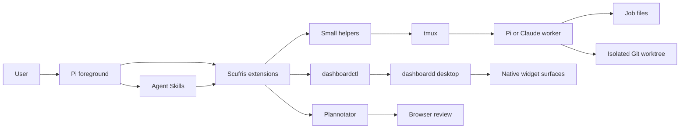
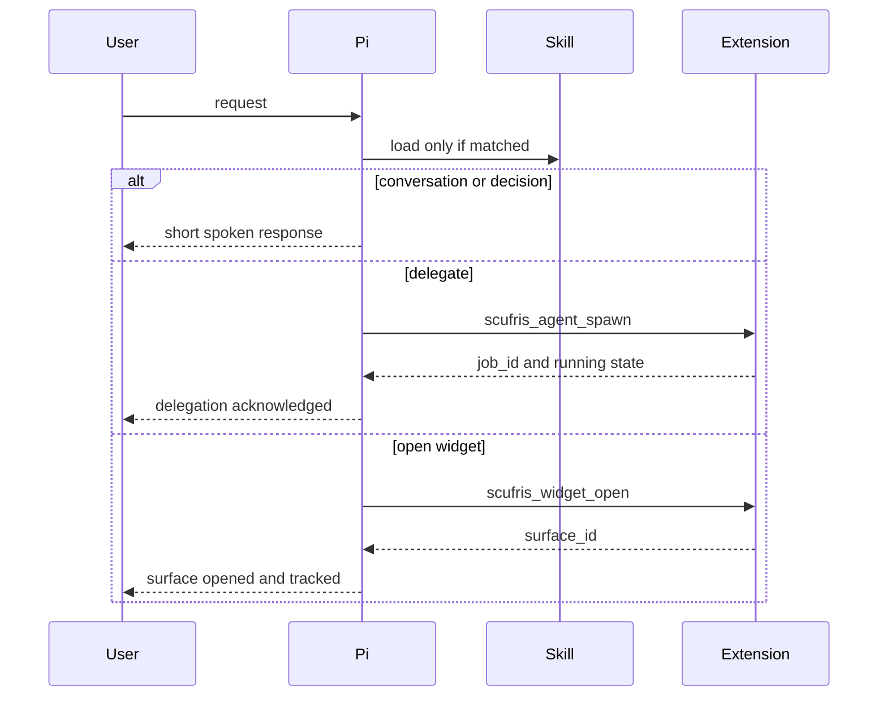
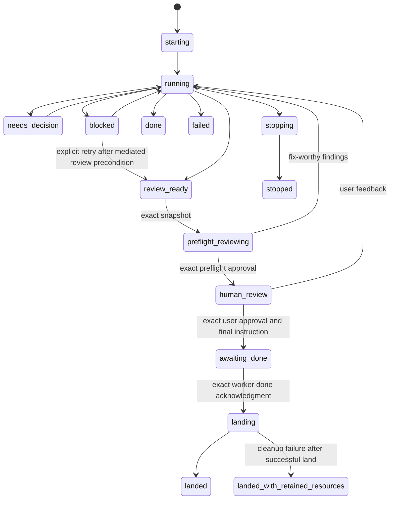
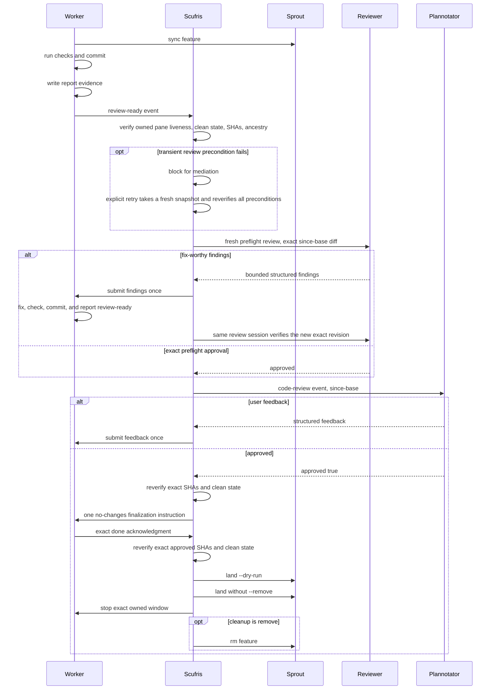
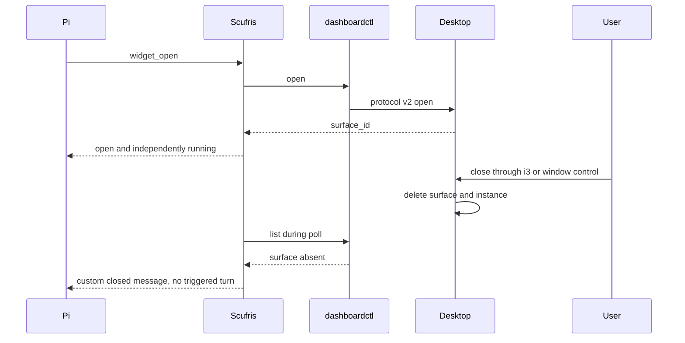

# Scufris architecture

## Recommendation

Build Scufris as one Pi package with:

- Independent delegation and widget TypeScript extensions.
- A full launcher that enables both extensions by default.
- A Home Manager module that can disable either extension and its matching skill.
- Agent Skills for delegation and widget workflows.
- Small Python and Bash helpers for job files, Git, tmux, and dashboardctl mechanics.
- Direct Pi or Claude Code processes in tmux.
- Sprout worktrees.
- Dashboardd as an external presentation service.

Do not add a daemon, MCP server, RPC bridge, embedded agent runtime, generic shell tool, data-query layer, or recovery supervisor.

## Boundaries



### Pi foreground

Owns:

- Conversation.
- Model selection and reasoning level.
- Built-in file tools.
- Skill discovery.
- Model mediation for decisions, blockers, completion, and failure.

Does not own:

- Worker execution.
- Native widget windows.
- Dashboard runtime instances.
- Git landing semantics.

### Scufris TypeScript extensions

The Scufris identity extension owns:

- Loading the canonical foreground orchestration prompt.
- Appending its complete canonical text in `before_agent_start` on every foreground agent run, including runs after compaction.
- Activation only from the `SCUFRIS_ROLE=orchestrator` process role.

The response extension owns:

- The terminating `scufris_final_response` tool and direct-text fallback.
- Private session-adjacent Markdown artifacts and opaque lookup.
- `/detail` Plannotator annotation requests and compact durable review rows.
- `/scufris-prompt` prompt inspection without a provider request.
- Transcript streaming suppression and the final-response prompt policy.

The delegation extension owns:

- Agent tool registration.
- Job ownership and status mediation.
- Its non-overlapping one-second job timer.
- Worker shutdown and orphan reporting.

The widget extension owns:

- Discovery-derived widget tool registration.
- Opened-surface ownership.
- Its non-overlapping one-second surface timer.
- External-close mediation.

Both use the shared bounded helper runtime. Neither parses shell commands, implements Git, inspects arbitrary paths, or embeds harness-specific process logic.

The Nix launcher and development runner set `SCUFRIS_ROLE=orchestrator` and load the identity extension before the other Scufris extensions. The worker launcher removes that role and invokes ambient Pi without Scufris extensions or skills. Normal Pi and direct package loading therefore do not receive the Scufris identity prompt.

### Skills

Own model-facing workflows:

- When delegation is appropriate.
- When a visual widget is appropriate.
- How to select spawn, inspect, send, stop, and widget tools.
- How to retain job and surface IDs in conversation context.

Skills do not own persistent background processes.

### Helpers

Own deterministic mechanics:

- Create and validate job records and optional descriptive feature slugs.
- Reject feature branch, worktree, and tmux session collisions before launch.
- Launch and address exact tmux windows through fixed helper verbs and generated IDs, then replace the helper process with the harness.
- Read incremental status bytes.
- Create, synchronize, and inspect sprout worktrees.
- Invoke dashboardctl without a shell.
- Validate Git revisions before review and landing.

Use Python standard library and small Bash adapters. Helpers accept narrow verbs and IDs. They do not expose raw command execution to the model.

### Delegated workers

Each worker is one direct interactive Pi or Claude Code process in one tmux window and one isolated worktree. Pi workers invoke the ambient `pi` executable without Scufris extensions or skills.

Workers own:

- Reasoning and tool use for the delegated request.
- Sparse status appends.
- `report.md`.
- Feature commits.
- Reading repository instructions, selecting applicable checks, and recording their outcomes before `review-ready:`.

Workers do not land, push, create other workers, or control dashboardd.

### Dashboardd

Owns:

- Widget discovery.
- Runtime instances and backends.
- Tauri windows.
- Surface focus and close.
- Native user-driven close behavior.

Scufris only invokes released `dashboardctl` operations and tracks returned surface IDs.

### Nix launcher and module

`nix run .#scufris` is the one flake app and enables delegation and widgets. The Home Manager module installs the same `scufris` command with host-specific composition:

```nix
programs.scufris = {
  enable = true;
  delegation.enable = true;
  widgets = {
    enable = true;
    dashboardctlPackage = inputs.dashboardd.packages.${pkgs.stdenv.hostPlatform.system}.dashboardd-desktop;
  };
};
```

Both features default to enabled. Disabling a feature removes its extension, skill, and runtime dependency. A consuming flake makes Scufris follow its existing Pi, Home Manager, nixpkgs, and dashboardd inputs:

```nix
scufris = {
  url = "github:alexjercan/scufris2/<release>";
  inputs.nixpkgs.follows = "nixpkgs";
  inputs.home-manager.follows = "home-manager";
  inputs.pi.follows = "pi";
  inputs.dashboardd.follows = "dashboardd";
};
```

### Plannotator and sprout

Sprout owns worktree creation, synchronization, landing, and resource removal. Plannotator owns human review presentation. Scufris calls Plannotator through its public Pi event API. After a green Sprout landing dry-run and a fresh exact snapshot, the helper calls installed `sprout land` without `--remove`. Scufris then stops its exact worker window. The job cleanup policy either retains the landed branch and worktree or calls `sprout rm`, which can remove the complete feature session and evict user-created windows.

## Project and harness policy

Scufris:

- Can run inside or outside a Git repository.
- Delegates to the current repository by default when one exists.
- Lists repositories below configured discovery roots as opaque project IDs for cross-project delegation.
- Resolves and verifies the selected ID before Sprout runs. Model-facing tools never accept filesystem paths.
- Defaults Pi to `openai-codex/gpt-5.6-sol` with medium thinking.
- Defaults Claude to `opus` with xhigh thinking.
- Lets the foreground orchestrator override model and thinking per spawn.
- Accepts an optional lowercase hyphen-separated feature slug of at most 48 characters. Uses it exactly, or generates `scufris-<job_id>` when omitted.
- Defaults cleanup to `remove`. Uses `retain` only when the user asks to keep landed branch and worktree resources.
- Rejects existing feature branches, worktrees, and matching tmux sessions. Never suffixes a requested name or reuses another job's resources.
- Does not sandbox filesystem or network access.
- Runs workers with local-user authority.
- Uses `--dangerously-skip-permissions` for Claude.

Workers read repository instructions and decide which checks apply. Scufris does not guess project commands or maintain a check list.

## State

### Session state

The enabled extensions keep only their own state:

- Delegation: opaque owned job IDs, selected feature display names, immutable cleanup policies, status offsets and tails, event identity, and worker-window state.
- Widgets: the validated catalog and opened surface IDs.
- Each: its own poll-in-progress and shutdown flags.

No timer cycle overlaps another cycle from the same extension. A slow cycle waits instead of overlapping.

### Durable job state

Root:

```text
${XDG_STATE_HOME:-$HOME/.local/state}/scufris/jobs/<job_id>/
```

Files:

```text
job.json    immutable extension-owned launch record
prompt.md   immutable worker instructions
status      append-only worker events
report.md   bounded worker result
```

Worktree:

```text
${XDG_CACHE_HOME:-$HOME/.cache}/sprouts/<project>/<feature>
```

Tmux:

```text
server:  normal user server
session: <project>_<feature>, matching Sprout session naming
window:  job-<job_id>
```

Scufris inherits the normal tmux server selection. The session name uses the exact selected feature and is rejected if it already exists. Scufris creates the session without attaching, selecting, or switching the user's client. The worker window receives the current safe path and configuration environment, starts in the worktree, and invokes the ambient harness directly. The opaque job ID and recorded exact session, window, and pane IDs define ownership; the descriptive feature and session names do not. User-created windows can share this session. Scufris ignores them: it does not inspect, target, close, or otherwise manage them. Scufris never kills a session or server.

The matching job directory and exact tmux window are both required for orphan eligibility. `remain-on-exit` retains a failed pane for manual debugging while pane-dead state marks the worker as exited. Ordinary stop targets only the owned worker window. Post-land `cleanup: remove` delegates full feature cleanup to `sprout rm`; this can remove all remaining windows in the feature session. `cleanup: retain` leaves the session, branch, and worktree in place after stopping the worker.

## Pair and delegation readiness

Scufris pairs automatically. There is no `/pair` command or deterministic router. It answers ordinary conversation, clarification, and product decisions directly. It delegates all project inspection, research, implementation, checks, task maintenance, diagnostics, releases, and deployment before foreground inspection.

Full-send is a prose judgment. Delegate one bounded outcome with no unresolved product or durable architecture decision and a self-contained handoff. The worker must inspect applicable instructions, context, code, history, and checks. Consequential or compaction-sensitive work uses delegated Tatr maintenance. Bounded research, prototypes, diagrams, and demos can run while Pair continues.

## Foreground request flow



No deterministic router runs before the model. Every final foreground response uses a terminating structured tool. Only its safe spoken paragraph and optional opaque detail command render. Direct model text is held until a safe fallback split is complete.

## Job lifecycle



Status lines are events, not authoritative process state. Current state is derived from:

- Last valid status event.
- Exact tmux window existence.
- Worker process exit.
- Review and landing checks.

A process exit without a valid terminal event becomes a foreground `failed` event. Scufris does not append a fake worker status line.

## Polling loops

Each enabled extension owns one non-overlapping one-second loop.

Delegation:

1. Return immediately if shutdown is active, no job is active, or the prior cycle still runs.
2. Read and parse appended status bytes for all active jobs.
3. Check exact tmux window existence.
4. Coalesce changes, update compact UI, and queue actionable model follow-ups.

Widgets:

1. Return immediately if shutdown is active, no surface is owned, or the prior cycle still runs.
2. Call `dashboardctl list` once.
3. Remove absent owned surfaces and emit one external-close message for each.

Do not emit unchanged status.

## Event presentation

| Event                                 | UI                       | Model turn                        |
| ------------------------------------- | ------------------------ | --------------------------------- |
| `working:`                            | Notify or compact status | No                                |
| `review-ready:`                       | Notify and start review  | Follow-up, trigger turn           |
| `needs-decision:`                     | Compact notification     | Follow-up, trigger turn           |
| `blocked:`                            | Compact notification     | Follow-up, trigger turn           |
| `done:`                               | Compact notification     | Follow-up, trigger turn           |
| `failed:`                             | Error notification       | Follow-up, trigger turn           |
| Protocol error                        | Error notification       | Follow-up, trigger turn           |
| Worker exited without terminal status | Error notification       | Follow-up, trigger turn           |
| Widget closed externally              | Compact notification     | Custom message, no triggered turn |

Custom messages identify Scufris as the source. They are not fake user messages.

## Steering

For ordinary steering:

1. Resolve the owned job ID to its recorded exact pane on the normal tmux server.
2. Load literal UTF-8 text into a unique tmux buffer.
3. Paste the buffer once.
4. Wait a fixed short delay.
5. Send Enter once.
6. Delete the buffer.

Never retype or retry Enter. A tmux command failure is a failed send. A successful tmux command is not proof that the harness processed the message; report delivery as submitted, not acknowledged.

## Review and landing



One committed revision is required per review round. An explicit retry after a transient review-precondition failure is the same round and does not require a new commit. It is accepted only for the owned blocked job marked retryable. It clears request and approval state, takes a fresh snapshot, and reruns every current tmux and Git precondition. Review outcomes and other lifecycle blockers are not retryable through this operation.

Every landable delegated job selects one preflight profile at spawn: code, consumer, operations, or interface. A non-landable result selects none. After `review-ready`, Scufris creates one detached `preflight-<review_id>` window in the exact worker feature session and starts the actual Pi reviewer there with Sol at medium thinking. It disables pane input, enables `remain-on-exit`, and does not attach or select a client. The private helper owns exact tmux, launcher, and reviewer-child identities, the dedicated Pi session, read-only built-in tool allowlist, bounded patch and structured result files, environment isolation, an exact 1800-second reviewer deadline, and pre/post snapshot checks. The helper signals when the exact reviewer child starts. This resets the extension deadline to 1810 seconds and gives the helper a fixed 10-second shutdown margin beyond reviewer execution. Live stdout and stderr go to the pane for inspection. Pane content is never result input or authority. The extension owns review policy, feedback cycles, revision-bound approval, Plannotator ordering, invalidation, and shutdown cancellation.

The reviewer receives repository instructions, a concise accepted-outcome and audience brief, and the exact base-to-feature diff. It can inspect the feature worktree with read-only tools. Co-location does not share context: it does not receive the implementation transcript, worker report, reasoning, or claims.

Preflight findings contain only fix-worthy BLOCKER, MAJOR, or MINOR items with a relative path, line, reason, and concrete correction. Feedback returns to the implementation worker. The same reviewer window and Pi session verify corrections. A third request for changes blocks for Pair mediation. Preflight approval binds to the exact landing and feature revisions. Plannotator opens only after that approval. User feedback invalidates approval and removes only the exact prior reviewer window and session before a fresh sequence. Cancellation and normal shutdown remove the exact owned reviewer window. Post-land retain keeps the dead reviewer pane and session evidence. Post-land remove delegates complete feature-session removal to Sprout.

Plannotator remains the user approval gate. Final approval requires a new `since-base` request and its structured `approved: true` result.

Review and landing validate only the recorded session, window, pane, and worker liveness. Unrelated windows in the same session are outside Scufris ownership during review, landing, retain cleanup, and exact worker stop. The user accepts that `sprout rm` can evict them for remove cleanup after successful landing.

A post-land stop or remove failure never rolls back or reports the merge as failed. Scufris emits one actionable `landed-with-retained-resources` result and keeps job evidence for manual cleanup.

Approval is invalid if:

- The worker does not append exactly `done: review approved with no changes requested` after the one approval instruction.
- Feature SHA changed.
- Landing-target SHA changed.
- Worktree became dirty.
- Target is no longer an ancestor.
- The response is not structured `approved: true`.

## Widget lifecycle



Scufris never reopens an externally closed surface and never calls close for an already absent surface.

## Trust boundaries

| Boundary            | Trust decision                                                 |
| ------------------- | -------------------------------------------------------------- |
| Pi package          | Installed code has full user authority                         |
| Selected repository | Pi project trust allows project instructions                   |
| Worker              | Explicit unrestricted local-user execution                     |
| Model provider      | Prompt, selected files, and tool traffic may leave the machine |
| Job files           | Worker-written bytes are untrusted protocol input              |
| tmux                | Exact session and window IDs only                              |
| Git                 | Verified discovered repository and generated worktree          |
| Plannotator         | Public event result and exact Git revisions                    |
| dashboardd          | Public dashboardctl commands only                              |
| Widget inputs       | May reach widget backends and webviews; exclude secrets        |

Never place credentials, environment dumps, raw transcripts, or unrelated file content in status summaries, widget inputs, or model follow-up messages.

## Shutdown and orphan discovery

Normal shutdown:

1. Set shutdown flag.
2. Clear the timer.
3. Stop each owned worker idempotently.
4. Clear Scufris UI status.
5. Forget surface tracking. Do not close user-facing widget windows automatically.

Startup orphan scan:

1. Scan bounded job-directory names.
2. List exact generated worker windows across worktree sessions on the normal tmux server.
3. Intersect job directories and windows.
4. Report candidates once.
5. Ask the user to retain or close them.

Do not adopt, inspect transcripts, restart, reconstruct offsets, or infer work from an orphan.
